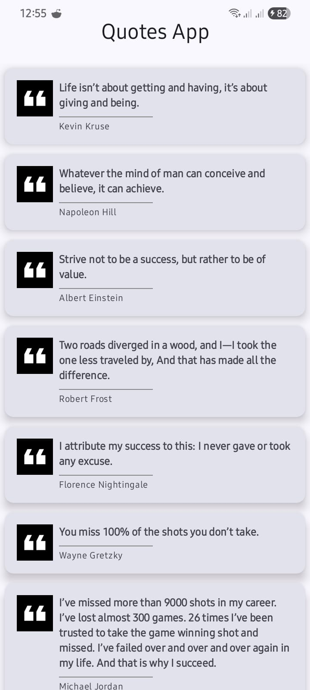
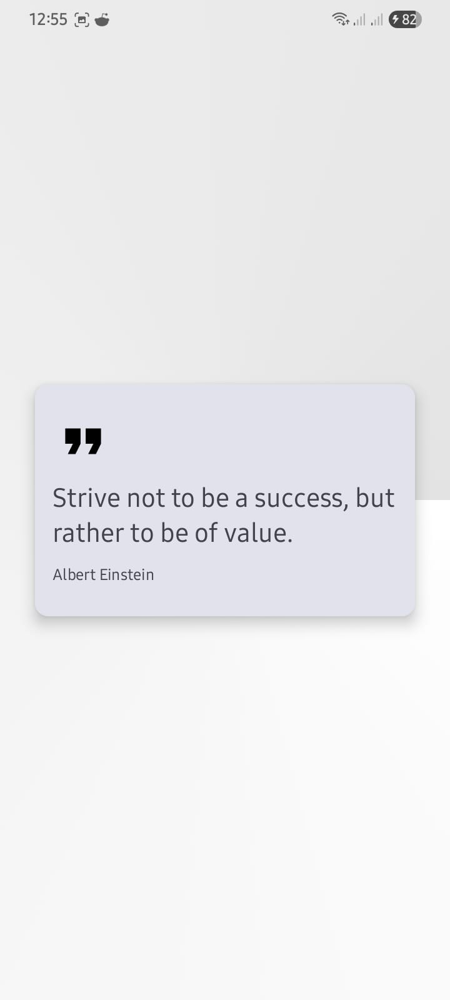

# Quotes App (Jetpack Compose + MVVM)

This project is an Android application built with **Jetpack Compose** and **MVVM architecture**.  
It fetches quotes from a remote API, caches them locally with Room, and displays them in a modern Compose UI.  
Users can browse a list of quotes, and tap on a quote to see its details.

---

## 🚀 Features

- **Jetpack Compose** UI (no XML layouts)
- **MVVM Architecture** with ViewModel & State management
- **Navigation Component** for Compose (list → detail screen)
- **Retrofit2** + **OkHttp** + **Gson Converter** for API integration
- **Room Database** for local caching of quotes
- **Coroutines** for background threading
- **Coil** (or Glide with accompanist) for image loading
- **Hilt** for dependency injection

---

## 🛠️ Tech Stack

- **Language:** Kotlin
- **UI:** Jetpack Compose
- **State Management:** ViewModel + StateFlow/LiveData
- **Networking:** Retrofit2, OkHttp, Logging Interceptor
- **Database:** Room (2.6.1)
- **Image Loading:** Coil (preferred for Compose) or Glide integration
- **DI:** Dagger Hilt (2.51.1)
- **Async:** Kotlin Coroutines (1.8.0)
- **Navigation:** Jetpack Compose Navigation

---

## 📸 Screenshots

